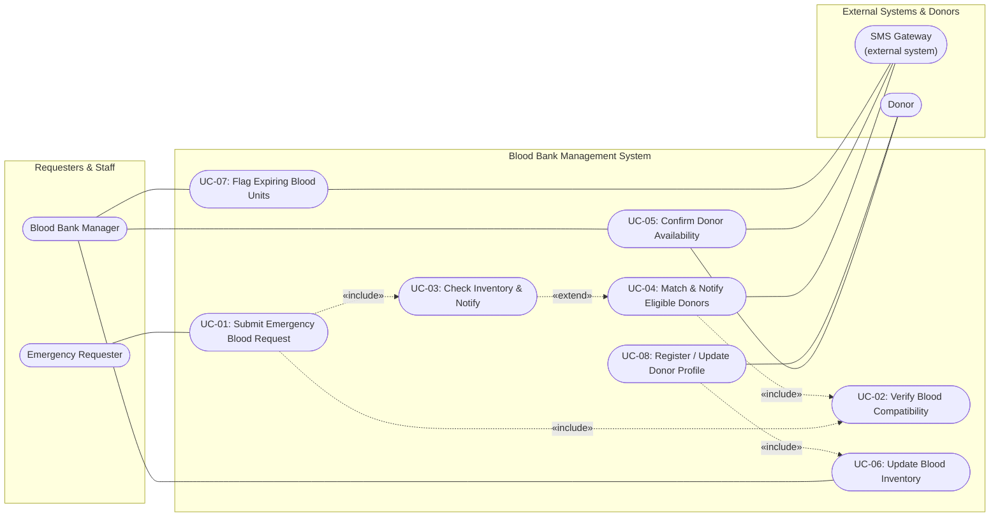

# Blood Bank Inventory & Emergency Donor Matcher

**Department of Computer Science and Engineering — PES University**  
**Course:** Software Engineering Lab  
**Lab 1:** Requirements Engineering & UML Use-Case Modelling  
**Problem Statement #12:** Blood Bank Inventory & Emergency Donor Matcher (Healthcare & Telemedicine)  
**Student Name:** Dabbugunta Venya Anand  
**SRN:** PES1UG24AM074  

---

## 1. Problem Context & Overview

Blood banks require a real-time stock management and emergency response system that monitors blood component shelf lives and triggers geo-targeted emergency notifications to matching eligible donors during critical shortages.

Perishable blood products (whole blood, plasma, platelets) have strict expiration windows. In critical emergencies, delays in locating compatible blood units or eligible nearby donors can be fatal. This system addresses these challenges through:
- Automated real-time inventory tracking and expiration alerts.
- Automated compatibility verification (ABO and Rh(D) matching).
- Geo-targeted donor notification (within a 10 km radius) during critical shortages.
- Strict transactional consistency to prevent double-allocation of life-saving units.

### Target Stakeholders & Actors
- **Primary Actors:**
  - **Blood Bank Manager:** Manages inventory stock levels, reviews expiry warnings, prioritizes allocations, and initiates transfers.
  - **Emergency Requester / Verified Medical Centre:** Submits high-urgency or scheduled blood unit requests.
  - **Donor:** Registers/updates medical profile, receives emergency alerts, and confirms donation availability.
- **Supporting / External Actors:**
  - **SMS Gateway (External System):** Delivers emergency broadcasts and alerts to donors and managers.
  - **Partner Blood Bank Network (External System):** Receives surplus transfer notifications and coordinates inter-facility transfers.

---

## 2. Requirements Specification

### Functional & Non-Functional Requirements Table

| Req ID | Type | Description | Priority | Acceptance Criteria | Rationale |
| :--- | :--- | :--- | :--- | :--- | :--- |
| **FR-001** | Functional | The system shall cross-reference emergency blood unit requests against real-time blood bank inventory and broadcast SMS alerts to compatible donors within a 10 km radius. | High | **Pass:** Compatible donors notified within 30 seconds of emergency flag. **Fail:** Incompatible blood group alerted. | Given requirement (baseline). Ensures the core emergency-matching function works correctly and quickly. |
| **FR-002** | Functional | The system shall verify ABO and Rh(D) compatibility between the requested blood type and each candidate donor's blood type before adding that donor to the notification list. | High | **Pass:** In test runs covering all 8 blood group combinations, zero incompatible donors appear in the notification list. **Fail:** Any incompatible donor is included. | Prevents life-threatening transfusion errors caused by incorrect blood-type matching. |
| **FR-003** | Functional | The system shall allow a Blood Bank Manager to add, remove, or adjust inventory counts by blood group and component type (whole blood, plasma, platelets). | High | **Pass:** Inventory count reflects the manager's change within 2 seconds and is visible on the dashboard. **Fail:** Count remains stale after 2 seconds or does not match the entered value. | Accurate, current stock levels are required before the system can correctly decide whether an emergency donor search is needed. |
| **FR-004** | Functional | The system shall allow verified medical centres to log high-urgency blood requests, capturing the required quantity, urgency level (Immediate/Code Red vs. Scheduled Surgery), and patient blood profile. | High | **Pass:** A verified medical centre can submit a request that captures quantity, urgency level, and blood profile, and the system rejects submission if the requester is unverified or any required field is missing. **Fail:** A request is accepted without an urgency level/blood profile, or from an unverified medical centre. | Ensures accurate triage so that Immediate/Code Red requests are prioritised for matching and fulfillment ahead of scheduled, non-emergency requests. |
| **FR-005** | Functional | The system shall automatically flag blood units nearing expiry (within 48 hours) on the Blood Bank Manager's dashboard. | Medium | **Pass:** 100% of units with less than 48 hours to expiry are shown flagged (e.g., in red) on the dashboard. **Fail:** Any qualifying unit is left unflagged. | Reduces wastage of perishable blood units and supports proactive stock rotation. |
| **NFR-001** | Nonfunctional *(Performance & Security)* | The inventory ledger must maintain strict transactional consistency, preventing simultaneous allocation of the same blood bag. | High | **Pass:** Benchmarking/load tests confirm target latency and no double-allocation under simulated peak concurrent load. **Fail:** Any test run produces a double-allocated unit or exceeds target latency. | Given requirement (baseline). Prevents double-booking of a single physical blood unit to two different requests. |
| **NFR-002** | Nonfunctional *(Security & Privacy)* | The system shall encrypt all donor personal and medical data (blood group, contact number, location) both in transit and at rest. | High | **Pass:** Security audit confirms TLS 1.2+ is used for all data in transit and AES-256 for all data at rest, with no field found in plaintext. **Fail:** Any donor data field is found unencrypted in transit or storage. | Protects sensitive personal health information and supports compliance with data-protection regulations. |

---

## 3. UML Use-Case Diagram

### Use Cases & Relationships
- **UC-01 (Submit Emergency Blood Request):** Initiated by Emergency Requester. Includes **UC-02** (verify blood compatibility) and **UC-03** (check current inventory).
- **UC-03 (Check Inventory & Notify):** When local inventory is insufficient, it extends to **UC-04** (Match & Notify Eligible Donors).
- **UC-04 (Match & Notify Eligible Donors):** Includes **UC-02** to ensure candidate donors are compatible before alerting them via the SMS Gateway.
- **UC-05 (Confirm Donor Availability):** Donors reply via SMS Gateway or app to confirm arrival; reviewed by Blood Bank Manager.
- **UC-06 (Update Blood Inventory):** Blood Bank Manager modifies stock levels; also included when a donor gives blood (**UC-08**).
- **UC-07 (Flag Expiring Blood Units):** Automated scan alerting Blood Bank Manager and SMS Gateway.
- **UC-08 (Register / Update Donor Profile):** Donor manages personal and medical details.

---

## 4. Use-Case Flow Specification

### Use Case: UC-07 — Flag Expiring Blood Units

- **Problem Statement:** Problem Statement #12: Blood Bank Inventory & Emergency Donor Matcher
- **Primary Actor:** Blood Bank Manager
- **Supporting Actors:** SMS Gateway (external system), Partner Blood Bank Network (external)

#### Preconditions
1. Every blood unit in inventory has a recorded collection date and calculated expiry date.
2. The system has a configured near-expiry threshold (e.g., 48 hours before expiry).
3. The Blood Bank Manager is authenticated and has access to the inventory dashboard.
4. The inventory database and SMS Gateway are online and reachable.

#### Postconditions
- **Success:** All units within the expiry threshold are flagged on the dashboard, an alert is sent to the Blood Bank Manager, and a near-expiry report is logged with status *"Flagged — Reviewed"* or *"Flagged — Pending Review."*
- **Failure:** The scheduled scan fails to complete (e.g., database timeout); the error is logged, and the Blood Bank Manager is notified so the scan can be re-triggered manually.

#### Main Success Scenario
1. The system's automated inventory monitor runs on a scheduled interval (e.g., every 30 minutes).
2. For each blood unit in inventory, the system calculates remaining shelf life (`expiry date − current timestamp`).
3. The system identifies all units whose remaining shelf life is below the configured threshold.
4. The system visually flags each identified unit (e.g., red indicator) on the inventory dashboard, grouped by blood group and component type.
5. The system compiles a consolidated near-expiry report and pushes an alert (dashboard notification and SMS/email) to the Blood Bank Manager.
6. The Blood Bank Manager reviews the flagged units and decides on an action — prioritize allocation to pending requests, transfer to another facility, or discard per protocol.
7. The Blood Bank Manager updates each unit's status to reflect the chosen action.
8. The use case ends successfully; the flagged-units list is refreshed, and an audit trail entry is created for every status change.

#### Alternate Flow — 5a: High Volume of Near-Expiry Units
- **a.** If the number of flagged units exceeds a configured overstock threshold, the system additionally notifies the partner blood bank network via the SMS Gateway, offering the surplus units for transfer.
- **b.** If a partner facility accepts, the system reserves the offered units and updates their status to *"Reserved — Transfer Pending."*
- **c.** If no partner facility accepts within a defined response window, the system marks the remaining unaccepted units for priority use in scheduled (non-emergency) procedures or flags them for disposal per protocol, and closes the item.
- **d.** The Blood Bank Manager receives a final disposition report summarizing transferred, reallocated, and discarded units; the flow rejoins step 8 of the main scenario.

---

## 5. Lab Submission Artifacts

- **Submission Document:** [`DabbuguntaVenyaAnand_PES1UG24AM074_LAB1.pdf`](./DabbuguntaVenyaAnand_PES1UG24AM074_LAB1.pdf)
  - Complete Requirements Table (FR-001 to FR-005, NFR-001, NFR-002)
  - UML Use-Case Diagram
  - Detailed Use-Case Flow Specification (UC-07)
